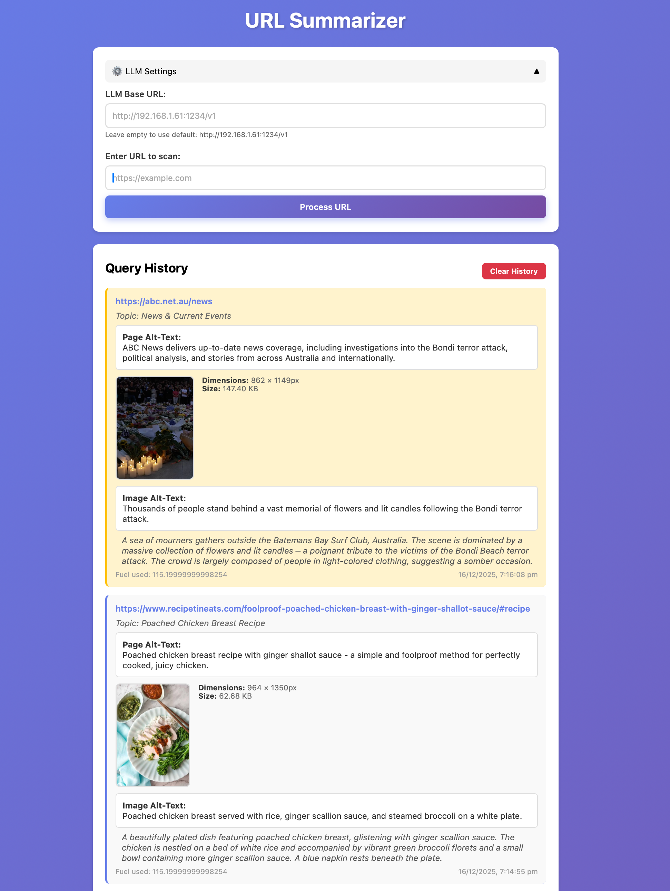

# Agent-99 URL Summarizer

An example project demonstrating [agent-99](https://github.com/tonioloewald/agent-99) - a type-safe-by-design, cost-limited virtual machine for safe execution of untrusted code.

This project demonstrates **idiomatic agent-99 patterns** for building secure, type-safe agent workflows. It scrapes URLs, extracts images, and uses LLMs to generate accessible alt-text summaries - all within agent-99's VM execution model.



## Features

- **Full VM Execution**: All operations execute within agent-99's isolated VM
- **Atom-Based Architecture**: Custom atoms for HTML processing, image extraction, and vision analysis
- **Pipeline Composition**: Type-safe pipelines using agent-99's builder API
- **Capability-Based Security**: All HTTP requests go through `httpFetch` atom
- **Fuel Tracking**: All operations tracked in VM fuel system
- **Type Safety**: Input/output schemas validated at runtime
- **Web App Interface**: Simple, modern web UI for URL processing
- **Image Analysis**: Finds most interesting images using LLM vision scoring

## Prerequisites

- [Bun](https://bun.sh/) runtime (recommended) or Node.js
- For local LLM support: [LM Studio](https://lmstudio.ai/) running on your configured endpoint

## Installation

```bash
# Install dependencies
bun install
```

## Usage

### Web App (Recommended)

Start the web server:

```bash
bun run dev
```

Then open your browser to `http://localhost:3000`

The web app provides:
- **Settings Panel**: Configure your LLM endpoint URL (collapsible)
- **URL Input**: Enter any URL to scan and generate alt-text
- **Results Display**: Newest results appear at the top
- **Query History**: View all previous queries with timestamps and metadata

### CLI Usage

```bash
# Generate page alt-text
bun run src/index.ts https://example.com

# Generate image alt-text
bun run src/index.ts --image https://example.com
```

### Programmatic Usage

```typescript
import { generateAltText, generateImageAltText, generateCombinedAltText } from './src/index'

// Generate page alt-text
const pageResult = await generateAltText('https://example.com')
console.log(pageResult.altText) // "Example domain for documentation and testing"

// Generate image alt-text
const imageResult = await generateImageAltText('https://example.com')
console.log(imageResult.altText) // "Screenshot of example.com homepage"

// Generate both page and image alt-text
const combinedResult = await generateCombinedAltText('https://example.com')
console.log(combinedResult.pageAltText) // Page alt-text
console.log(combinedResult.imageAltText) // Image alt-text
```

## Idiomatic Agent-99 Patterns

This project demonstrates **best practices** for building agent-99 applications. All code follows the "agents-as-data" principle where logic is compiled to JSON AST and executed in an isolated VM.

### Core Principles

1. **Agents-as-Data**: All logic compiles to JSON AST before execution
2. **Functions-as-Schemas**: Every operation has type-safe input/output schemas
3. **Safe-by-Design**: Capability-based security, fuel limits, isolated execution
4. **Pipeline Composition**: Build workflows using fluent builder API

### Pattern 1: Complete Pipeline Within VM

**Idiomatic**: All operations execute within the VM

```typescript
const vm = createVM()
const b = vm.A99

const logic = b
  // Step 1: Fetch webpage using httpFetch atom (capability-based security)
  // Note: httpFetch returns a Response object when using custom fetch capability
  .httpFetch({ url: A99.args('url') })
  .as('httpResult')
  // Step 1.5: Extract text from Response (body can only be read once)
  .extractResponseText({ response: A99.args('httpResult') })
  .as('html')
  
  // Step 2: Extract text using custom atom
  .htmlExtractText({ html: A99.args('html') })
  .as('pageText')
  
  // Step 3: Build prompt using custom atom
  .buildUserPrompt({ url: A99.args('url') })
  .as('userPrompt')
  
  // Step 4: Generate alt-text using LLM atom
  .llmPredictBattery({
    system: '...',
    user: A99.args('userPrompt'),
    responseFormat: { ... }
  })
  .as('summary')
  .varGet({ key: 'summary.content' })
  .as('jsonContent')
  .jsonParse({ str: 'jsonContent' })
  .as('parsed')
  
  // Step 5: Return structured output
  .return(
    s.object({
      altText: s.string,
      topic: s.string,
    })
  )

// Compile to AST
const ast = logic.toJSON()

// Execute in VM
const result = await vm.run(ast, { url }, { fuel: 10000, capabilities })
```

**Benefits**:
- Full capability-based security
- Fuel tracking for all operations
- Logic is serializable (can be stored/replayed)
- Type-safe with schema validation

### Pattern 2: Custom Atoms for Domain Logic

**Idiomatic**: Create custom atoms for reusable operations

```typescript
// Define custom atom with input/output schemas
const extractImagesFromHTMLAtom = defineAtom(
  'extractImagesFromHTML',
  s.object({ html: s.string, baseUrl: s.string }), // Input schema
  s.array(s.object({                              // Output schema
    url: s.string,
    width: s.any,
    height: s.any,
    alt: s.any,
    area: s.any,
  })),
  async ({ html, baseUrl }, ctx) => {
    // Implementation uses capabilities from context
    return extractImagesFromHTML(html, baseUrl)
  },
  { docs: 'Extract image information from HTML', cost: 5 }
)

// Register in VM
function createVM() {
  return new AgentVM({
    extractImagesFromHTML: extractImagesFromHTMLAtom,
    // ... other atoms
  })
}

// Use in pipeline
const logic = b
  .httpFetch({ url: A99.args('url') })
  .as('httpResult')
  .extractResponseText({ response: A99.args('httpResult') })  // Extract text from Response
  .as('html')
  .extractImagesFromHTML({ 
    html: A99.args('html'), 
    baseUrl: A99.args('url') 
  })
  .as('images')
```

**Benefits**:
- Reusable across pipelines
- Type-safe with schemas
- Cost tracking (fuel consumption)
- Documented with metadata

### Pattern 3: Parallel Processing Within Atoms

**Idiomatic**: Handle parallel operations inside atoms

```typescript
const processCandidateImagesAtom = defineAtom(
  'processCandidateImages',
  s.object({ 
    candidates: s.array(s.object({ ... })),
    pageContext: s.any,
  }),
  s.array(s.object({ ... })),
  async ({ candidates, pageContext }, ctx) => {
    const fetchCap = ctx.capabilities.fetch || fetch
    const llmCap = ctx.capabilities.llm
    
    // Parallel fetching inside atom
    const candidateData = await Promise.all(
      candidates.map(async (img) => {
        const response = await fetchCap(img.url)
        // ... process image
        return { img, imageData, error: null }
      })
    )
    
    // Parallel scoring inside atom
    const scoredCandidates = await Promise.all(
      validCandidates.map(async ({ img, imageData }) => {
        const llmResponse = await llmCap.predictWithVision(...)
        return { img, imageData, score: parsed.score }
      })
    )
    
    return scoredCandidates
  },
  { docs: 'Process candidate images in parallel', cost: 250, timeoutMs: 120000 }
)
```

**Benefits**:
- Parallel operations encapsulated in atom
- Still tracked in fuel system
- Can be reused in other pipelines

### Pattern 4: Variable Management

**Idiomatic**: Use variable store for intermediate values

```typescript
const logic = b
  .httpFetch({ url: A99.args('url') })
  .as('httpResult')                              // Alias current result
  .extractResponseText({ response: A99.args('httpResult') }) // Extract text from Response
  .as('html')
  .varSet({ key: 'html', value: 'html' })        // Store for later use
  .varGet({ key: 'html' })
  .as('htmlValue')
  .htmlExtractText({ html: A99.args('htmlValue') })
  .as('pageText')
  .varSet({ key: 'pageText', value: 'pageText' }) // Store for later
  .buildUserPrompt({ url: A99.args('url') })      // Uses stored pageText
  .as('userPrompt')
```

**Note**: `httpFetch` returns a Response object, so use `extractResponseText` atom to get the text content. Don't use `.varGet({ key: 'response.text' })` as this gets the method reference, not the actual text.

**Benefits**:
- Type-safe variable access
- Clear data flow
- Reusable intermediate values

### Pattern 5: Error Handling and Fallbacks

**Idiomatic**: Handle errors within atoms with fallbacks

```typescript
const scoreImageInterestingnessAtom = defineAtom(
  'scoreImageInterestingness',
  s.object({ ... }),
  s.number,
  async ({ imageDataUri, imageInfo, pageContext }, ctx) => {
    try {
      const llmCap = ctx.capabilities.llm
      const llmResponse = await llmCap.predictWithVision(...)
      const parsed = JSON.parse(llmResponse.content)
      return parsed.score || 0
    } catch (error) {
      // Fallback: use size/area as proxy
      if (imageInfo.area) return Math.min(50, imageInfo.area / 10000)
      if (imageInfo.size) return Math.min(50, imageInfo.size / 100000)
      return 0
    }
  },
  { docs: 'Score image for interestingness', cost: 200 }
)
```

**Benefits**:
- Graceful degradation
- Operations continue even if LLM fails
- Fallback logic encapsulated

### Pattern 6: Capability-Based Security

**Idiomatic**: All external operations use capabilities

```typescript
// Provide capabilities explicitly
const capabilitiesWithFetch = {
  ...customCapabilities,
  fetch: customCapabilities.fetch || batteries.fetch || fetch,
}

// Execute with capabilities
const result = await vm.run(
  ast,
  { url },
  {
    fuel: 10000,
    capabilities: capabilitiesWithFetch, // Only these are available
  }
)

// Inside atoms, access via context
async ({ url }, ctx) => {
  const fetchCap = ctx.capabilities.fetch // Explicit capability access
  const response = await fetchCap(url)
  // ...
}
```

**Benefits**:
- Explicit security model
- Can restrict capabilities per execution
- Easy to mock for testing

## Architecture Overview

### Execution Flow

1. **Pipeline Construction**: Build type-safe pipeline using builder API
2. **AST Compilation**: Compile pipeline to JSON AST (`.toJSON()`)
3. **VM Execution**: Execute AST in isolated VM with explicit capabilities
4. **Result Extraction**: Get structured output with type validation

### Custom Atoms

This project defines several custom atoms:

- **`extractResponseText`**: Extracts text from HTTP Response objects (handles both Response.text() and direct strings)
- **`htmlExtractText`**: Extracts text content from HTML
- **`extractImagesFromHTML`**: Extracts image information from HTML
- **`filterCandidateImages`**: Filters images larger than icon size
- **`processCandidateImages`**: Fetches and scores images in parallel
- **`scoreImageInterestingness`**: Scores images using LLM vision
- **`buildUserPrompt`**: Constructs LLM prompts from context
- **`llmPredictBatteryLongTimeout`**: LLM calls with extended timeout
- **`llmVisionBattery`**: Vision-capable LLM calls

### Important: Argument Reference Resolution

Custom atoms receive `A99.args()` as argument reference objects (`{ $kind: 'arg', path: 'name' }`), not actual values. Atoms must resolve these from context:

```typescript
async ({ myParam }, ctx) => {
  // Resolve argument reference
  let actualValue = myParam
  if (myParam && typeof myParam === 'object' && '$kind' in myParam && myParam.$kind === 'arg') {
    actualValue = ctx.args?.[myParam.path] || ctx.state?.[myParam.path] || ctx.vars?.[myParam.path]
  }
  // Use actualValue instead of myParam
}
```

### Pipeline Examples

#### Example 1: Page Alt-Text Generation

```typescript
const logic = b
  .httpFetch({ url: A99.args('url') })        // Fetch webpage (returns Response object)
  .as('httpResult')
  .extractResponseText({ response: A99.args('httpResult') }) // Extract text once
  .as('html')
  .varSet({ key: 'html', value: 'html' })     // Store for later use
  .varGet({ key: 'html' })
  .as('htmlValue')
  .htmlExtractText({ html: A99.args('htmlValue') }) // Extract text
  .as('pageText')
  .varSet({ key: 'pageText', value: 'pageText' })
  .buildUserPrompt({ url: A99.args('url') })   // Build prompt
  .as('userPrompt')
  .llmPredictBattery({                         // Generate alt-text
    system: '...',
    user: A99.args('userPrompt'),
    responseFormat: { ... }
  })
  .as('summary')
  .varGet({ key: 'summary.content' })
  .as('jsonContent')
  .jsonParse({ str: 'jsonContent' })
  .as('parsed')
  .return(
    s.object({
      altText: s.string,
      topic: s.string,
    })
  )
```

#### Example 2: Image Processing Pipeline

```typescript
const logic = b
  .httpFetch({ url: A99.args('url') })
  .as('httpResult')
  .extractResponseText({ response: A99.args('httpResult') })
  .as('html')
  .varSet({ key: 'html', value: 'html' })
  .varGet({ key: 'html' })
  .as('htmlValue')
  .extractImagesFromHTML({                     // Extract images
    html: A99.args('html'),
    baseUrl: A99.args('url')
  })
  .as('images')
  .filterCandidateImages({                     // Filter candidates
    images: A99.args('images'),
    maxCandidates: 3
  })
  .as('candidates')
  .processCandidateImages({                    // Fetch & score in parallel
    candidates: A99.args('candidates'),
    pageContext: A99.args('pageContext')
  })
  .as('scoredCandidates')
  .return(s.object({ candidates: s.array(...) }))
```

## Configuration

### LLM Setup

The web app allows you to configure the LLM endpoint directly in the UI:

1. Click the "LLM Settings" panel to expand it
2. Enter your LLM base URL (e.g., `http://localhost:1234/v1` or `http://192.168.1.61:1234/v1`)
3. The `/v1` suffix is automatically added if not present
4. Settings are saved to browser localStorage

**For Local Development with LM Studio:**

1. **Install LM Studio** - Download from [LM Studio](https://lmstudio.ai/)
2. **Download a Model** - Recommended: 3B-7B parameter models for faster responses
3. **Load the Model** - Select model in Chat tab
4. **Start Local Server** - Click "Local Server" tab and start server (default: `http://localhost:1234`)
5. **Verify Server** - Navigate to `http://localhost:1234/v1/models` in browser
6. **Configure in App** - Enter URL in settings panel

**Default LLM URL:** `http://192.168.1.61:1234/v1` (can be changed in web app settings)

## Project Structure

```
.
├── src/
│   ├── index.ts          # Core implementation with atoms and pipelines
│   ├── server.ts         # Web server and API endpoints
│   ├── index.html        # Web app frontend
│   └── example.test.ts   # Test suite
├── package.json          # Dependencies
├── tsconfig.json         # TypeScript configuration
├── README.md            # This file
├── TESTING.md           # Test instructions
├── CHANGELOG.md         # Change history
└── ATOM_PIPELINE_ANALYSIS.md  # Architecture analysis
```

## Key Concepts

### Agent-99 Execution Model

- **AST-based**: Logic compiled to JSON AST before execution
- **Isolated VM**: Each execution runs in stateless, isolated environment
- **Fuel Budget**: Execution limited by fuel to prevent runaway processes
- **Capabilities**: Security model where VM can only access what's explicitly provided

### Schema System

All atoms use `tosijs-schema` for type-safe input/output:

```typescript
s.object({
  url: s.string,
  width: s.any,  // Optional fields use s.any
  height: s.any,
})
```

### Fuel System

Each atom has a cost that consumes fuel:

```typescript
defineAtom(
  'myAtom',
  inputSchema,
  outputSchema,
  implementation,
  { docs: 'Description', cost: 10, timeoutMs: 5000 }
)
```

## Testing

Run the test suite:

```bash
bun test
```

See [TESTING.md](./TESTING.md) for detailed testing instructions.

## Limitations

- Local LLM requires LM Studio to be running for battery mode
- Image processing requires vision-capable LLM models
- Large pages may hit token limits (currently limited to 3000 chars for prompts)

## License

MIT

## References

- [agent-99 GitHub](https://github.com/tonioloewald/agent-99)
- [agent-99 Documentation](https://github.com/tonioloewald/agent-99#readme)
